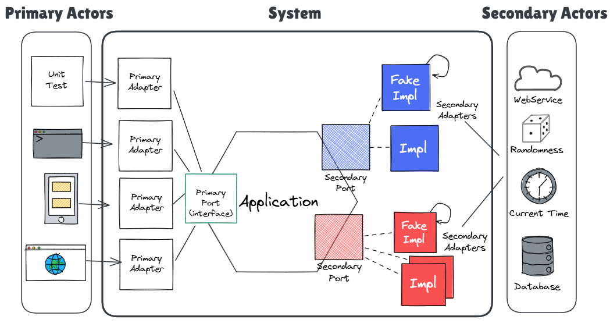

<!-- _class: invert -->
<!-- _footer: '' -->
<!-- _paginate: false -->
# Hexagonal Architecture: Origins and Context
A guide by Armando Cordova

@corlaez

---
# The idea in one sentence

> An application should be equally usable by a person, another program,
> or a test. And you should be able to run it with the internet and the DB down

- The creator behind it: Alistair Cockburn

---
# Roadmap
1. **Origins:** the community and the pain that produced the idea (1986-2005)
2. **A short guide:** scope, lingo, and a diagram
3. **Parallels:** the same shape in FP and in Wirfs-Brock's Object Design
4. **In practice:** what it buys you, and where people go wrong

---
<!-- _class: invert -->
<!-- _footer: '' -->
# Part I : Origins

---
# The community that shaped it
- **1986:** First **OOPSLA** conference. **_The_ object-oriented conference** for years
- **1990:** _'Designing Object-Oriented Software'_ by Rebecca Wirfs-Brock
- **1995:** Ward Cunningham creates C2, the first Wiki
  - The online world's place to discuss software patterns and architectures
- **1997:** Wirfs-Brock mentors and reviews Alistair's _'Surviving Object-Oriented Projects'_
- **2001:** _'Writing Effective Use Cases'_ by Alistair. Remember this one
- **2002:** _'Object Design: Roles, Responsibilities, and Collaborations'_ by Wirfs-Brock

> Hexagonal was not made in one day. It was refined with a decade of conversation.

---
# The pain it answered
- **90s and 00s:** 3-tier architecture is dominant
  - Business logic coupled to the database and to the framework
  - You cannot run the app, nor a test, without the whole stack up
- **2002:** Automated acceptance testing enters the picture
  - **Fit** by Ward Cunningham: tests as HTML tables
  - **Fitnesse** by Micah Martin: a wiki and web server for Fit with ASCII tables

> If tests are to be first-class, the app has to be runnable **without** its devices.

---
# The architecture before the article
- **Smalltalk background:** instant feedback, fast experimentation, event-driven
  - With discipline, primary and secondary adapters are simple to add-or-swap
- **Network Illustrator** and **Faulty Disk Storage:**
  - "For adding events" (GUI, file, network), "For showing picture" (HTML, file)
  - Add a loopback (fake) to replace the faulty disk persistence
- **1994:** Alistair presents his architectural ideas at OOPSLA '94
  - The **_Design Patterns_** book debuted that same year
- **1998:** Shared with friends and peers
  - Mho Salim's Weather Warning System, XP practitioner Kevin Rutherford

---

---
# How the 2005 article came to be
- Early 00s C2 Wiki pages: **Hexagonal Architecture** first, then **Ports and Adapters**
  - Pages were edited in place. Years of conversation survive, the revisions do not
- Alistair formalizes the ideas and writes the 2005 article, crediting:
  - **Wirfs-Brock's _Object Design_ (2002):** her Interfacer == Alistair's Transformer
  - **GoF _Design Patterns_:** the adapter pattern, used directly and helped name it
  - **Kevin Rutherford:** wrote articles that motivated Alistair to write his official doc

---
<!-- _class: invert -->
<!-- _footer: '' -->
# Part II : A short guide

---
# Scope
## In scope
- The application runs without a UI or a database
  - Run it under automated tests, with no GUI
  - Run it when the database (or the network) is unavailable

## Out of scope
- File names, folder structure, layer counts
- Details about how to structure your domain

---
# The asterisk: Alistair and the use cases
- A lot of Alistair's work through the years talks about use cases
- The 2005 article has a section on use cases and the application boundary
  - They should not have any technology dependency
- However, as time went on I find Alistair mentions use cases less and less
- He seems much more interested in guidance for naming ports (interfaces) lately:
  - `ForPlacingOrders` (primary), `ForStoringUsers` (secondary)
  - Essentially: name the purpose, never the technology

---
# What about ports
- A port is a purposeful conversation, not a method. Expect several methods in one
- A use case implements a primary port and depends on a group of secondary ports
- Many technologies depend on one primary port (GUI, CLI and tests)
- Many technologies implement one secondary port (postgresql, in-memory, file)
  - Grouped by external actor. A secondary adapter mustn't talk to an API and DB

> Primary port specifies what the app does. Secondary ports group who it talks to.

---
# Why the hexagon?

- There is nothing inherently "6-sided"
- Alistair chose the figure for illustration
- Many facets $\rightarrow$ many ports
- **"Ports & Adapters"** is his preferred name for the architecture
- The hexagon name endured anyway

---
# Lingo: primary (driver) vs. secondary (driven)
- **Driving / primary side:** triggers that invoke the app
  - **Adapter:** translates external input (HTTP, CLI, Kafka) into core commands
  - **Port:** the API the core exposes *(could be implicit)*
- **Driven / secondary side:** invoked by the app
  - **Port:** interface for a needed capability (save, notify, charge)
  - **Adapter:** concrete implementation (postgresql, in-memory, file)
- **Application ("inside the hexagon"):** use cases, domain model

> The primary side calls the app. The app calls the secondary side.
> The app is the foundation, the adapters depend on the app

---

---
# Why are primary ports optional?
- A primary port has exactly one real implementation: the application itself
- The port is the public contract. An explicit interface is a separate choice
  - Ruby and friends: nothing to declare. His 2023 Ruby example declares none
  - Java and friends: Alistair does declare an interface for primary ports
    - Note: some practitioners skip the interface and use mock libraries instead

---
<!-- _class: invert -->
<!-- _footer: '' -->
# Part III : The parallels

---
# FP & 'Functional core, imperative shell' parallels
- **Primary adapters** $\rightarrow$ translate triggers into input commands
- **Primary ports** $\rightarrow$ public API function types ($f: Input \to Output$)
- **Application core** $\rightarrow$ functional core (pure, no side effects)
- **Secondary ports** --> algebraic effects / capability contracts
- **Secondary adapters** --> side effects & effect interpreters (I/O runtime)

> The secondary side is where the two differ.
> The FP core returns effects, to be executed later and outside the application.

---
# Wirfs-Brock's 'Object Design' parallels
- **Primary adapters** $\rightarrow$ Interfacer
- **Primary ports** $\rightarrow$ public API (optional)
- **Application core** $\rightarrow$ Controller, Coordinator, Service Provider, etc
- **Secondary ports & adapters** $\rightarrow$ Interfacer

> The vocabulary is new. The decomposition is not.

---
<!-- _class: invert -->
<!-- _footer: '' -->
# Part IV : In practice

---
# What it buys you, where people go wrong
**What you get**
- A test suite that runs with no database, no network, no browser
- Swapping Postgres for an in-memory fake is a wiring change, not a rewrite

**Where people go wrong**
- Leaking framework types or side effects into the application core
- Thinking it dictates folder structure or naming
- Assuming it mandates DDD, CQRS or that it is the same as Clean Architecture

---
# Extra thoughts
- The 2005 article is dated by now
  - Interesting as an historic device and to get more context on the pattern
  - I would advise checking his 2023 talk and/or getting his 2025 book instead
- A notable variant: Omit the explicit interface 
  - and use a mock library on primary adapter tests

---
# Some useful links
- C2 pages: [HexagonalArchitecture](https://wiki.c2.com/?HexagonalArchitecture) & [PortsAndAdaptersArchitecture](https://wiki.c2.com/?PortsAndAdaptersArchitecture)
- Rutherford's blog: [snapshot of silkandspinach.net/blog/archives](https://web.archive.org/web/20060209233610/http://silkandspinach.net/blog/archives.html)
- 2005 article: [snapshot with comments](https://web.archive.org/web/20140329201018/http://alistair.cockburn.us/Hexagonal+architecture) & [current website (no comments)](https://alistair.cockburn.us/hexagonal-architecture)
- 2017 Talk by Alistair: [Inside the Hexagon](https://www.youtube.com/watch?v=th4AgBcrEHA)
- 2020 [Interview with Alistair Cockburn](https://jmgarridopaz.github.io/content/interviewalistair.html) by Garrido de Paz
- 2023 Talk by Alistair: [Hexagonal Architecture from its Inventor](https://www.youtube.com/watch?v=Gsgisj1Ns40)
- The book: [_Hexagonal Architecture Explained_](https://www.amazon.com/dp/B0F5QSH28F), Cockburn & Garrido de Paz
  - 2024 preview, 2025 updated first edition. In memory of Juan M. Garrido de Paz
- [Boundaries talk](https://www.youtube.com/watch?v=yTkzNHF6rMs) by Gary Bernhardt (Functional Core Imperative Shell)

---
<!-- _class: invert -->
<!-- _footer: '' -->
# Thanks
Github: @corlaez
