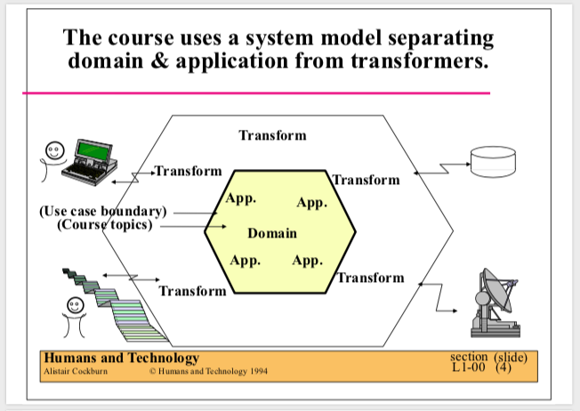
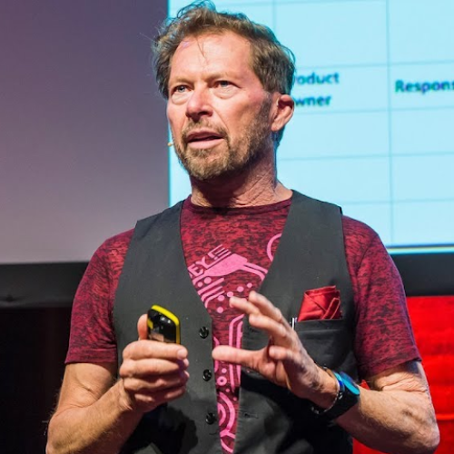

<!-- _class: invert -->
<!-- _footer: '' -->
<!-- _paginate: false -->
# Hexagonal Architecture: Origins and Context
A guide by Armando Cordova

@corlaez

---
# The idea in one sentence

> An application should be equally usable by a person, another program,
> or a test. And you should be able to run it even if internet or your DB is down

- That is the whole goal. Everything else is technique
- The rest of this talk: **where it came from**, and **what it actually asks of you**

---
# Roadmap
1. **Origins:**  the community and the pain that produced the idea (1986–2005)
2. **The guide:**  scope, lingo, and the diagram
3. **Parallels:**  the same shape in FP and in Wirfs-Brock's Object Design
4. **In practice:**  what it buys you, and where people go wrong

---
<!-- _class: invert -->
<!-- _footer: '' -->
# Part I : Origins

---
# The community that shaped it
- **1986:** First **OOPSLA** conference. **_The_ object-oriented conference** for years
- **1990:** _'Designing Object-Oriented Software'_ — Rebecca Wirfs-Brock
- **1995:** Ward Cunningham creates C2, the first Wiki
  - The online world's place to discuss software patterns and architectures
- **1997:** Wirfs-Brock mentors and reviews Alistair's _'Surviving Object-Oriented Projects'_ 
- **2002:** _'Object Design: Roles, Responsibilities, and Collaborations'_ by Wirfs-Brock

> Hexagonal was not made in one day. It was refined with a decade of conversation.

---
# The pain it answered
- **90s–00s:** 3-tier architecture is dominant
  - Business logic coupled to the database and to the framework
  - You cannot run the app, nor a test, without the whole stack up
- **2002:** Automated Acceptance testing enters the picture
  - **Fit** by Ward Cunningham: tests as HTML tables
  - **Fitnesse** by Micah Martin: a wiki and web server for Fit with ASCII tables

> If tests are to be first-class, the app has to be runnable **without** its devices.

---
# The architecture before the article
- **Smalltalk background:** instant feedback, fast experimentation, event-driven
  - With discipline, primary and secondary adapters are simple to add-or-swap
- **Network Illustrator** and **Faulty Disk Storage:**
  - "For adding events" (GUI, file, network), "For showing picture" (HTML, file)
  - Add a loopback (fake) to replace the faulty disk persistence
- **1994:** Alistair presents his architectural ideas at OOPSLA '94
  - The **_Design Patterns_** book debuted that same year
- **1998:** Shared with friends and peers
  - Moh Salim's Weather Warning System, XP practitioner Kevin Rutherford

---

---
# How the 2005 article came to be
- c2 wiki pages: **Hexagonal Architecture** first, then **Ports and Adapters**
  - These contain years of online conversation and post updates (no history)
- Alistair formalizes the ideas and writes the 2005 article, crediting:
  - **Rebecca's _Object Design_ (2002):** Her Interfacer == Alistair's Transformer
  - **GoF _Design Patterns_:** the adapter pattern, and the source of the new name
  - **Kevin Rutherford:** Wrote opinion articles that motivated Alistair to write his own

<!-- Speaker note: 680 sounds and colors -->

---

<!-- _class: invert -->
<!-- _footer: '' -->
# Part II : The guide

---
# Scope
## In scope
- The application runs without a UI or a database
  - Run it under automated tests, with no GUI
  - Keep working when the database (or the network) is unavailable

## Out of scope
- How to organize the business logic
- File names, folder structure, layer counts

> If you can turn on airplane mode and your automated tests pass, you are golden

---
# Why the hexagon?

- There is nothing inherently "6-sided"
- Alistair chose the figure for illustration
- Many facets $\rightarrow$ many ports
- His preferred name is **"Ports & Adapters"**
- The hexagon name endured anyway

---
# Lingo: primary (driver) vs. secondary (driven)
- **Driving / primary side:** triggers that invoke the app
  - **Adapter:** translates external input (HTTP, CLI, Kafka) into core commands
  - **Port:** the API the core exposes *(optional)*
- **Driven / secondary side:** invoked by the app
  - **Port:** interface for a required capability (e.g. `UserRepository`)
  - **Adapter:** concrete implementation (Postgres, Stripe, in-memory fake)
- **Application ("inside the hexagon"):** use cases, domain model

---

---
# Why are primary ports optional?
- A primary port has exactly one real implementation: the application itself
- The port is the public contract — an **explicit interface** is a separate choice
- Reasons to declare one anyway: it lets you write a fake application
- Reasons to skip it: mock libraries fake concrete types cleanly
- Some reject faking the application at all, and drive tests through the real one

---

<!-- _class: invert -->
<!-- _footer: '' -->
# Part III : The parallels

---
# FP & 'Functional core, imperative shell' parallels
- **Primary adapters** $\rightarrow$ translate triggers into input commands
- **Primary ports** $\rightarrow$ public API function types ($f: Input \to Output$)
- **Application core** $\rightarrow$ functional core (pure, no side effects)
- **Secondary ports** --> algebraic effects / capability contracts
- **Secondary adapters**  --> side effects & effect interpreters (I/O runtime)

> Secondary part is significantly different/not pressent
> The FP would return effects to be executed later, outside the application
---
# Wirfs-Brock's 'Object Design' parallels
- **Primary adapters** $\rightarrow$ Interfacer
- **Primary ports** $\rightarrow$ public API (optional)
- **Application core** $\rightarrow$ perhaps the Collaborator (Alistair leaves this undefined)
- **Secondary ports & adapters** $\rightarrow$ Interfacer

> The vocabulary is new. The decomposition is not.

---
# In practice
**What you get**
- A test suite that runs with no database, no network, no browser
- Swapping Postgres for an in-memory fake is a wiring change, not a rewrite

**Where people go wrong**
- Treating it as a folder layout instead of a dependency direction
- Leaking framework or ORM types through a port
- Building ports for capabilities nothing needs yet
- Assuming it mandates DDD, CQRS, or four layers. It mandates none of them

---
# Some useful links
- Earliest C2 page ([wiki.c2.com/?HexagonalArchitecture](https://wiki.c2.com/?HexagonalArchitecture))
- Newer C2 page ([wiki.c2.com/?PortsAndAdaptersArchitecture](https://wiki.c2.com/?PortsAndAdaptersArchitecture))
- Rutherford's articles about Hexagonal Architecture:
https://web.archive.org/web/20060209233610/http://silkandspinach.net/blog/archives.html
- 2005 article snapshot, with comments https://web.archive.org/web/20140329201018/http://alistair.cockburn.us/Hexagonal+architecture
- 2005 article in Alistair's website (no comments): 
[alistair.cockburn.us/hexagonal-architecture](https://alistair.cockburn.us/hexagonal-architecture)

---
<!-- _class: invert -->
<!-- _footer: '' -->
# Thanks
Github: @corlaez
